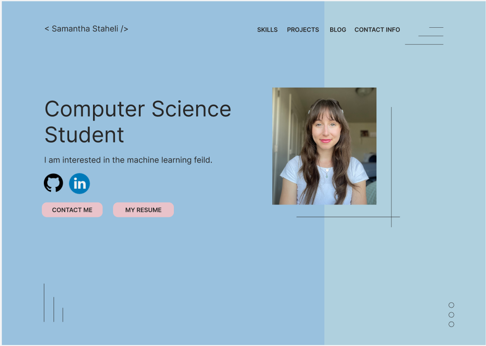
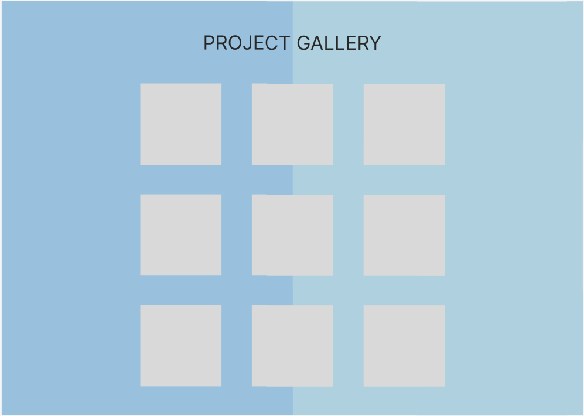
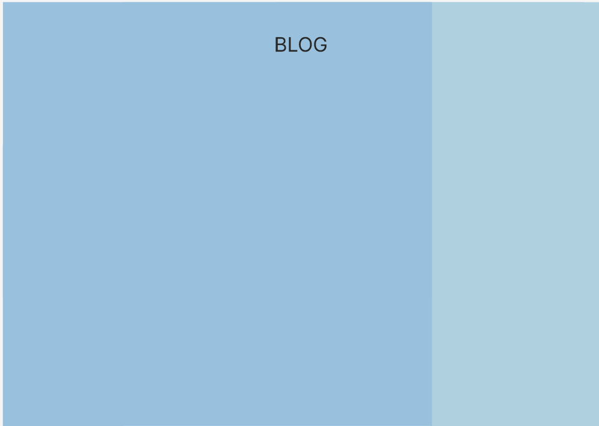

# My Portfolio

## Overview

The website made in this repository is a web portfolio. The purpose of creating this web portfolio is to display my projects and skills. The website can also act as a resume.

[Website Link](https://samanthastaheli.github.io/portfolio/index.html)

### Wireframe 

[Figma Link](https://www.figma.com/embed?embed_host=share&url=https%3A%2F%2Fwww.figma.com%2Ffile%2FK9chxBaQUK3tW0LXPqG18Y%2Fweb-portfolio%3Fnode-id%3D0%253A1)

### YouTube demonstration
The following link is a walkthrough of the code and working website. 
[Software Demo Video](http://youtube.link.goes.here)

## Web Pages

Currenly there is only one webpage. This is the home page that displays my name, photo, bio, and links. There are links to my GitHub and LinkedIn accounts. There is also a contact me button and my resume button.

## Development Environment

The IDE used was Visual Studio Code. The progamming languages used are HTML, CSS, and JavaScipt.

## Useful Websites

* [w3schools](https://www.w3schools.com/css/css3_buttons.asp)
* [CSS Tricks](https://css-tricks.com/snippets/css/complete-guide-grid/)
* [Figma](https://www.figma.com/files/recent?fuid=950841595300302177)

## Future Work

* More pages
* Menu bar
* Adjust and add shapes
